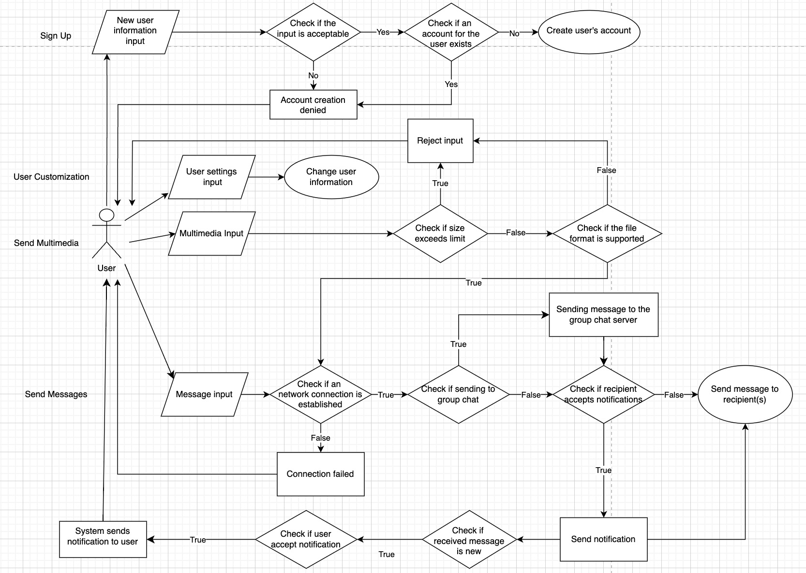

# CPSC-362-Chat-App-Project
## Group 6: 
- Alexander Blocker
- Anh Mai
- Matthew Lim
- Ngoc Chung Tran

## Table of Contents
- [Overview](#overview)
- [Project Vision](#project-vision)
- [Features](#features)
- [Functional Requirements](#functional-requirements)
- [Context Diagram](#context-diagram)

## Overview
The Chat Application is designed for real-time communication, allowing users to send text messages, share media, and participate in group conversations. This project provides a fast, secure, and user-friendly chat experience.

## Project Vision
For individual users and small groups or businesses who need efficient, secure communication, our Online Chat Application is the communication platform that provides real-time messaging with media sharing and group chat capabilities. 

Unlike other existing chat apps, our product prioritizes user experience and incorporates features such as easy-to-use interface, customization options, along with fast and reliable messages delivery, ensuring the standards of safety and privacy for our user.

## Features
User Registration & Login: Secure user authentication.
Real-time Messaging: Instant message delivery.
Multimedia Sharing: Share images, videos, and files in conversations.
Group Chats: Create and join chat groups.
Notifications: Receive real-time notifications for new messages.

## Functional Requirements

| **ID** | **Name**                  | **Description**                                                    | **Actor**        | **Precondition**                                    | **Main Success Scenario**                                                                 | **Extensions**                                                                                      |
|--------|---------------------------|--------------------------------------------------------------------|------------------|----------------------------------------------------|------------------------------------------------------------------------------------------------------|------------------------------------------------------------------------------------------------------|
| 001    | User Profile Creation and Customization  | Allows users to create an account, log in, and log out of the system | User             | User has a valid email address.                    | 1. User enters details. <br>2. System creates an account. <br>3. User logs in and is directed to the dashboard. | Invalid email or password. <br> Email already registered. <br> Account recovery if forgotten password. |
| 002    | Send & Receive Messages    | Allows users to send and receive real-time messages with other users. | User             | User is logged in and chatting with another user.  | 1. User opens chat window. <br>2. User types a message and clicks “Send.” <br>3. System sends the message in real-time. | Recipient is offline (message stored for later). <br> Network failure. Retry sending.         |
| 003    | Multimedia Sharing         | Allows users to upload and share images, videos, and files in chats.  | User             | User is logged in and in an active chat.           | 1. User clicks "Upload." <br>2. Selects a file. <br>3. System uploads and sends the file. | File size exceeds limit. <br> Unsupported file format.                                        |
| 004    | Group Chat Functionality   | Users can create or join group chats with multiple participants.      | User             | User is logged in.                                 | 1. User selects "Create Group." <br>2. User invites others to join. <br>3. Group chat is created. | Invitee rejects group invite. <br> User leaves group, system updates the group list.            |
| 005    | Notifications              | System notifies users when a new message is received.                 | User, System     | User is logged in, but chat window is inactive.    | 1. System detects new message. <br>2. Sends a notification to the user's device.           | "Do Not Disturb" mode prevents notification.                                                      |

## Context Diagram


## Some Features:

-   🌟 Tech stack: MERN + Socket.io + TailwindCSS + Daisy UI
-   🎃 Authentication && Authorization with JWT
-   👾 Real-time messaging with Socket.io
-   🚀 Online user status (Socket.io and React Context)
-   👌 Global state management with Zustand
-   🐞 Error handling both on the server and on the client
-   ⭐ At the end Deployment like a pro for FREE!
-   ⏳ And much more!

### Setup .env file
Postman Link: https://app.getpostman.com/join-team?invite_code=01e925e1a56ca1d0bbb543f3a2fb28b1

```js
PORT=...
MONGO_DB_URI=...
JWT_SECRET=...
NODE_ENV=...
```

### Build the app

```shell
npm run build
```

### Start the app

```shell
npm start
```
